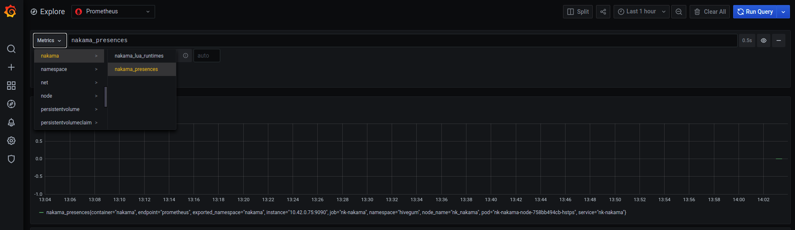

# Nakama Helm chart

[Nakama](https://github.com/heroiclabs/nakama) [Helm](https://helm.sh/) chart.

**Beware of the naming between values (k8s convention lower camel case) and Nakama config (snake case)**

## Usage

You should have a container image built with your custom Nakama with your plugins, for example:

```dockerfile
FROM heroiclabs/nakama-pluginbuilder:3.0.0 AS builder

ENV GO111MODULE on
ENV CGO_ENABLED 1

WORKDIR /backend

# Copy your plugins (Go, Lua, TS)
COPY . .

# ./cmd/main contains your Go entrypoint (that registers plugins)
RUN go build -mod=mod --trimpath --buildmode=plugin -o ./backend.so ./cmd/main

FROM heroiclabs/nakama:3.0.0
COPY --from=builder /backend/*.so /nakama/data/modules
COPY --from=builder /backend/lua/*.lua /nakama/data/modules
```

Your image is hosted on a repository (DockerHub, Github Registry ...), [you might also use a local k3s/minikube that 
pull from local repository](https://k3d.io/usage/guides/registries/#using-a-local-registry).

```bash
helm repo add louis030195 https://louis030195.github.io/helm-charts
helm repo update
helm install nk louis030195/nakama --set image.repository=myrepository,image.tag=mytag -n mynamespace
```

Or using your custom values file

```bash
helm install nk louis030195/nakama -f my-values.yaml -n mynamespace
```

## Additional Features

- Open console on The Internet `--set console.nodePort=30025`
- Metrics scrapping using [Kubernetes Prometheus Operator](https://github.com/prometheus-community/helm-charts/tree/main/charts/kube-prometheus-stack)
  * Install Prometheus Operator for example on "observability" namespace. 
	
	**Be aware that Prometheus Operator requires special rights on the cluster to find resources** 
  * Install Nakama with prometheusOperator enabled (it deploys a custom CRD used by Prom to find the resources)
	
	`helm install nk nakama --set image.repository=myrepository,monitoring.metrics.prometheusOperator.enabled=true -n mynamespace`
  * Then follow the instructions in Helm notes to reach your Nakama metrics on Grafana, you then can build any dashboards:
	
	
  * Since Grafana support alerting, you could send alerts when there is presence spikes to your team Discord !
	
	
  * Then tell Grafana to send alerts to this channel
	

## TODO

- [ ] Log forwarding <https://github.com/timberio/vector>
- [ ] Additional initContainer, container
- [ ] Node affinity
- [ ] postgresql support
- [ ] Nakama enterprise support 
- [ ] Cockroachdb / postgresql dependency
- [ ] Provide a JSON Grafana dashboards for Nakama


## Troubleshooting

- Using Minikube and trying to reach your node in a local network?  
  `ssh -i ~/.minikube/machines/minikube/id_rsa docker@$(minikube ip) -L \*:$MY_NODE_PORT:0.0.0.0:$MY_NODE_PORT`
